# Personal Portfolio – Blanca Faura

##  Project Overview

This project is a personal portfolio website built using only HTML and CSS, based on a given Figma design. The objective was to replicate the layout and visual style of the Figma reference. 
The project consists of an HTML file with an external CSS file linked to it for styling.

The website includes the following sections:

- Navigation bar
- Header section
- About section
- Skills section
- Experience section
- Work/projects section
- Testimonials
- Contact section
- Footer

## Figma Reference

This project is based on the following Figma design:
[Figma Design – Personal Portfolio Template](https://www.figma.com/design/Zt3mNfbilEETsoYg8vnVGN/Personal-Portfolio-Website-Template-%7C-Mobile---Desktop--Community-?node-id=327-868&p=f&t=Je3FhRcO8ax5CefX-0)

## Public repository on GitHub

This project is publicly available on GitHub at the following repository:

[Public repository on GitHub](https://github.com/blancafaura05-beep/PUBLIC)

## Public URL of the project

You can view the portfolio online at the following link:

 [Public URL of the project](https://blancafaura05-beep.github.io/PUBLIC/)

 ## Images - Desktop Version

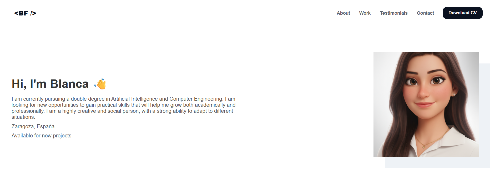  
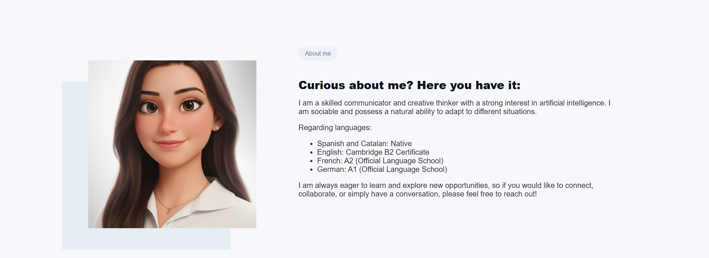  
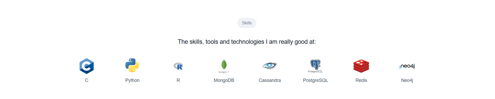  
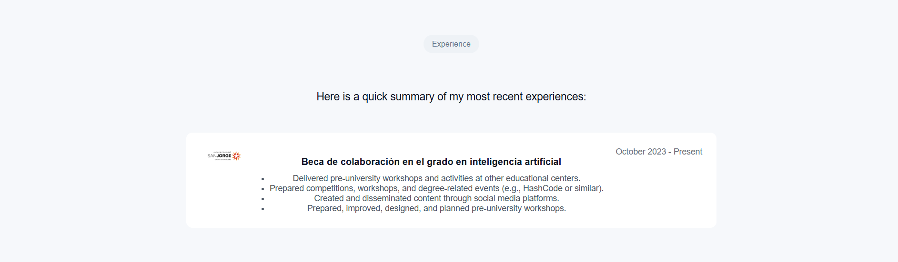  
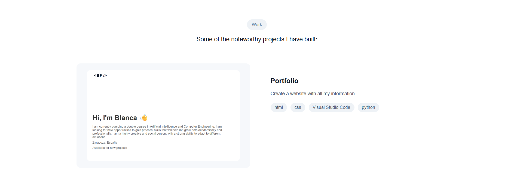  
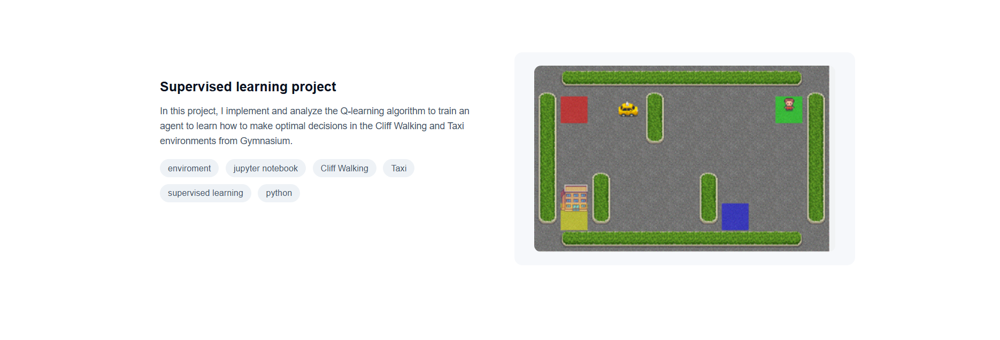  
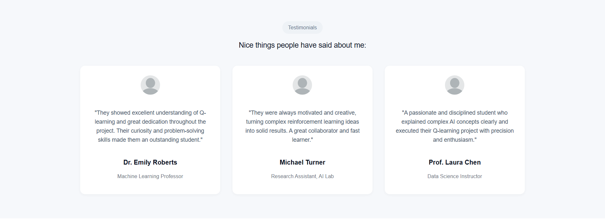  
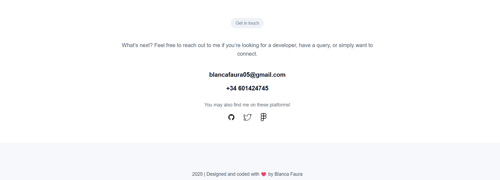  

## Images - Mobile Version

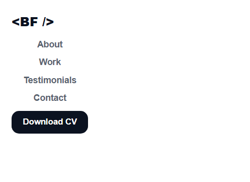  
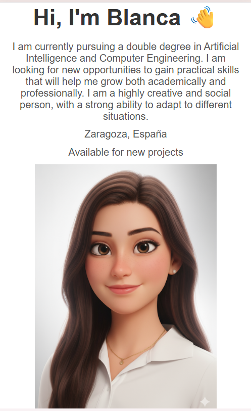  
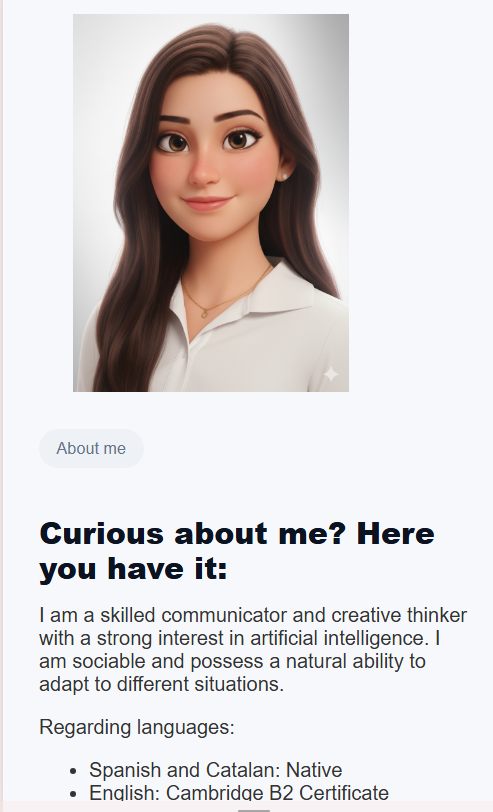  
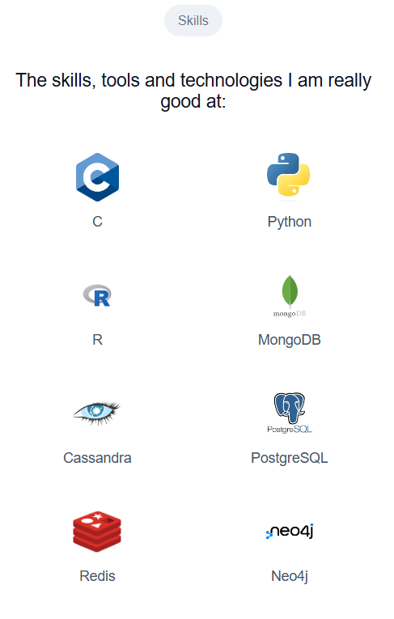  
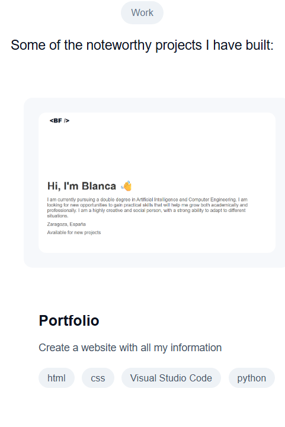  
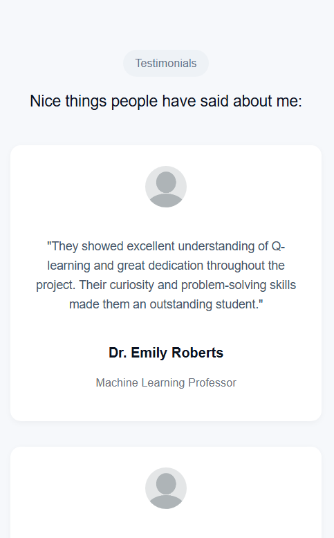  
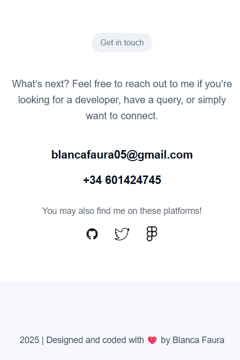 